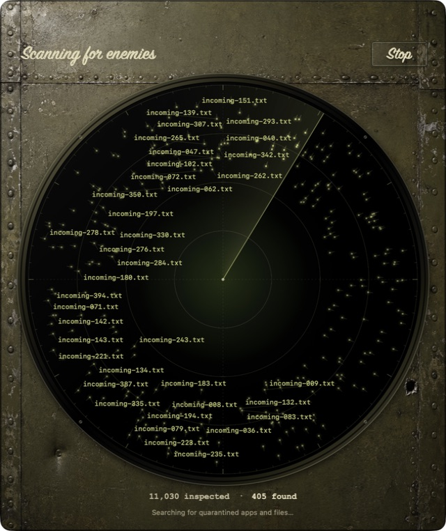

**A quiet enemy can lurk in your Mac’s metadata, slowing trusted apps and builds. It’s time to take performance back.**

Liberator finds quarantine flags with a sweeping radar, lets you review every target, and clears the files you trust—with undo.

**Scan for enemies. Pick your targets. Liberate your Mac.**

*Always the latest signed, notarized release. Verify with `shasum -a 256 -c Liberator.dmg.sha256` from the [release page](https://github.com/justin-schroeder/liberator/releases/latest).*

macOS 14+ · Native SwiftUI · No accounts or telemetry

See the radar

Developer preview. Quarantine is metadata, not a malware diagnosis. [Build & release](DEVELOPMENT.md) · [Privacy](PRIVACY.md) · [Security](SECURITY.md)
